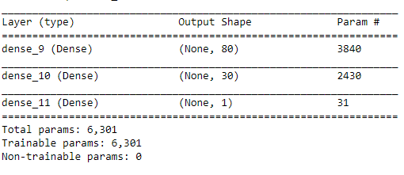
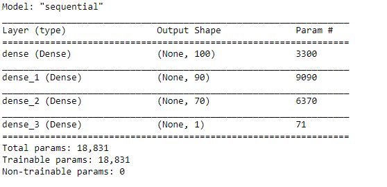
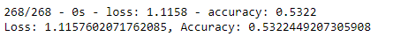
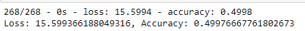

# Neural_Network_Charity_Analysis

## Overview
From Alphabet Soup’s business team, There are more than 34,000 organizations that have received funding from Alphabet Soup over the years. 

Within this dataset are a number of columns that capture metadata about each organization, such as the following:

EIN and NAME — Identification columns

APPLICATION_TYPE — Alphabet Soup application type

AFFILIATION — Affiliated sector of industry

CLASSIFICATION — Government organization classification

USE_CASE — Use case for funding

ORGANIZATION — Organization type

STATUS — Active status

INCOME_AMT — Income classification

SPECIAL_CONSIDERATIONS — Special consideration for application

ASK_AMT — Funding amount requested

IS_SUCCESSFUL — Was the money used effectively

## Result
With my knowledge of machine learning and neural networks, I’ll use the features in the provided dataset to help Beks create a binary classifier that is capable of predicting whether applicants will be successful if funded by Alphabet Soup.

### Data Preprocessing
What variable(s) are considered the target(s) for your model?
 - IS_SUCCESSSFUL is the target.

What variable(s) are considered to be the features for your model?
 - for the first model, except IS_SUCCESSSFUL which is the target, I also exclude EIN and NAME.
 - for the second model, except IS_SUCCESSSFUL which is the target, I exclude EIN, NAME add ASK_AMOUNT

What variable(s) are neither targets nor features, and should be removed from the input data?
  - EIN and NAME are removed.
  - EIN, NAME add ASK_AMOUNT are removed.

### Compiling, Training, and Evaluating the Model

How many neurons, layers, and activation functions did you select for your neural network model, and why?

### For the first model, I set 2 hidden layers, for which I use ReLu activiation function. I set sigmoid for the output layer.

### For the second model, I set 3 hidden layers, for which I use ReLu activiation function. I set sigmoid for the output layer.

### Were you able to achieve the target model performance?

 - The performance is around 0.5, which is not very good.
 
 - The performance is still around 0.5 after optimization.

### What steps did you take to try and increase model performance?

 - Delete categorical levels with extreme low frequency.
 - Delete ASK_AMOUNT
 - add one more idden layer
 - add more neurons 

## Summary

The model does not perform well, with accuracy around 0.5. After optimization, It does not improve either.
I would recommand to try decision tree or random forest.  
